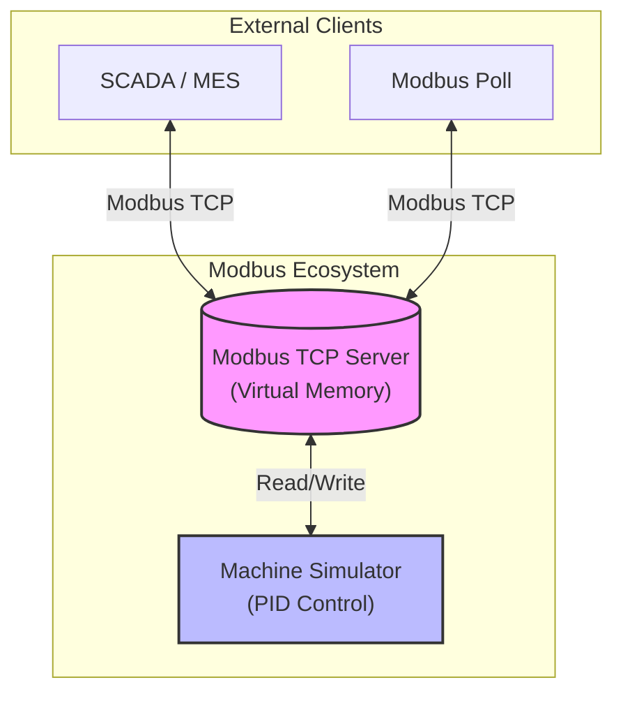

# 🛠️ Modbus TCP Server & Machine Simulator


**스마트 팩토리 데이터 연동 시뮬레이션 솔루션**  
.NET 10 WinForms 기반의 Modbus TCP 서버와 PID 제어 로직이 탑재된 기계 제어 시뮬레이터의 결합 프로젝트입니다.

---

## 🏗️ System Architecture



---


## 🌟 Key Features

### 📡 Modbus Server (The Hub)
- **Standard Protocol:** FC 03, 04, 06, 10 완벽 지원.
- **High Concurrency:** 비동기 `Socket` 통신으로 다중 클라이언트 안정적 처리.
- **Memory Mapping:** 100개의 가상 Holding Register 제공 (Base 0).

### 🌡️ Machine Simulator (The Edge)
- **Advanced PID Control:** P, I, D 게인 기반의 정밀 목표 온도 추종.
- **Physics Engine:** 열 관성, 외부 냉각, 가열 효율이 반영된 동적 온도 시뮬레이션.
- **Auto Sync:** 서버의 제어 명령(Run/Stop, SV)을 실시간 감시하고 상태(PV, Out)를 업데이트.

---

## 📊 Holding Register Map (40001 ~)

| Category | Address | Function | Data Type | Scaling |
| :--- | :--- | :--- | :--- | :--- |
| **Control** | 40001 | 목표 온도 (SV) | ushort | 1:1 |
| | 40002 | PID - P Gain | ushort | x100 |
| | 40003 | PID - I Gain | ushort | x100 |
| | 40004 | PID - D Gain | ushort | x100 |
| | 40005 | Run/Stop Switch | ushort | 0/1 |
| **Status** | 40011 | 현재 온도 (PV) | ushort | x10 |
| | 40012 | 히터 출력 (%) | ushort | 0~100 |
| | 40013 | 가동 상태 (Running) | ushort | 0/1 |

---

## 🚀 Getting Started

### Prerequisites
- [.NET 10.0 SDK](https://dotnet.microsoft.com/download/dotnet/10.0)
- Windows OS (WinForms)

### Installation & Run
1. **Clone the repository**
   ```bash
   git clone https://github.com/your-repo/ModbusServer.git
   ```
2. **Run Server**
   - `ModbusServer.sln` 실행 후 `ModbusServer` 프로젝트 시작.
   - 포트 502번 대기 확인.
3. **Run Simulator**
   - `MacahineControl_Simulator` 프로젝트 실행.
   - `Connect` 버튼을 눌러 서버와 연결.

---

## 🛠️ Tech Stack
- **Language:** C# 13
- **Runtime:** .NET 10.0
- **Library:** `System.Net.Sockets` (No external Modbus lib)
- **UI:** WinForms

---
*Developed by Gemini CLI Agent & Human Collaboration.*
